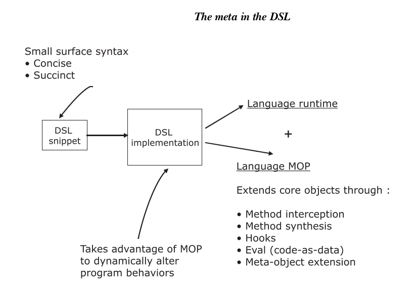
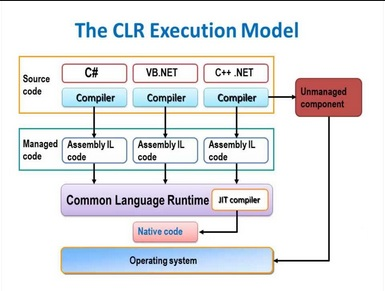
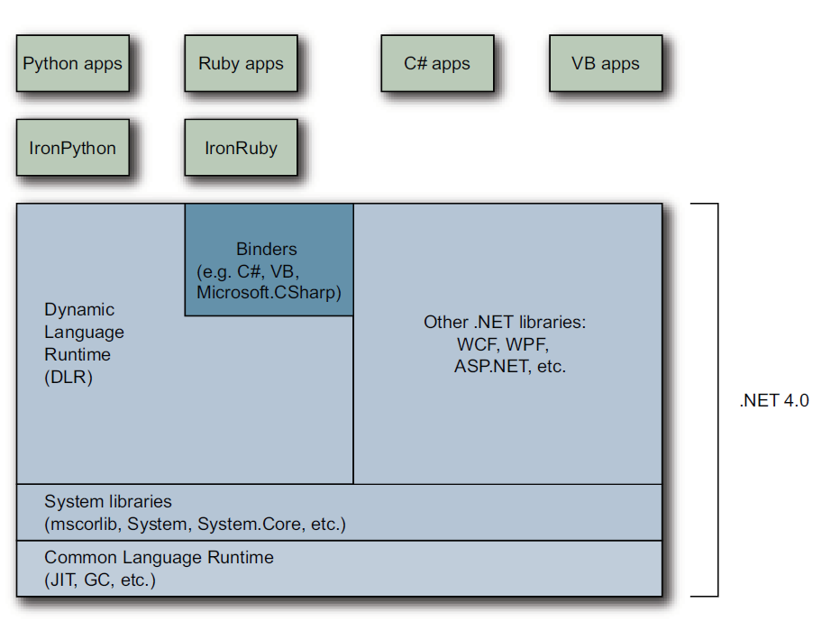
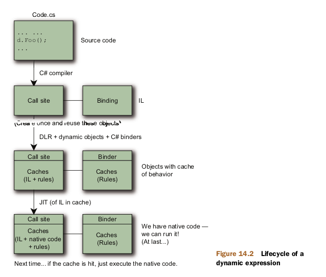

# Lenguajes de programación. Seminario 2

# Tema 4: Dynamic en C#

## Integrantes

- Javier E. Domínguez Hernández C-312
- David Orlando De Quesada Oliva C-311
- Daniel de la Cruz Prieto C-311

### 1. Implementar un DSL en C# 3.5

```c#
//Accediendo a directamente a los atributos
var p1 = Factory.New.Person;
p1.FirstName = "David";
p1.LastName = "De Quesada";

//Accediendo a los atributos en forma de diccionario
var p2 = Factory.New.Person;
p2["FirstName"] = "Louis";
p2["LastName"] = "Dejardin";

//Inicializando mediante una fluent interface
var p3 = Factory.New.Person.FirstName("Leonardo").LastName("Da Vinci");

// Con notación similar a JSON
var p4 = Factory.New.Person(FirstName: "Ana", Lastname: "De Armas");
```

Para que el código previo funcionara creamos una clase Person con dos propiedades FirstName y LastName para poder acceder a los atributos.

```c#
public class Person
    {   
        public Person(){}
        public Person (string FName, string LName){
            this.FirstName = FName;
            this.LastName = LName;
        }
        public string FirstName { get; set; }
        public string LastName { get; set; }

    }
```

También implementamos un indexer para poder acceder en forma de diccionario a las propiedades como se puede observar.

```c#
public string this[string index]{
            get{
                if (index == "FirstName")
                    return this.FirstName;

                if (index == "LastName")
                    return this.LastName;
                else
                    throw new System.Exception("This property does not exist");
            }

            set{
                if (index == "FirstName")
                    this.FirstName = value;

                else if (index == "LastName")
                    this.LastName = value;
                else
                    throw new System.Exception("This property does not exist");
            }
        }
```

Para inicializar en forma de fluent interface utilizamos métodos extensores como se puede apreciar a continuación:

```c#
public  static class ExtendPerson
    {
        public static Person FirstName(this Person person, string name)
        {
            person.FirstName = name;
            return person;
        }

        public static Person LastName(this Person person, string name)
        {
            person.LastName = name;
            return person;
        }
    }
```

Fluent interface es un patrón de diseño que se basa en el encadenamiento de llamados a métodos, con el objetivo de que el código se parezca más al lenguaje natural.

### 2. DSL dinámico C# 4.0

Para implementar la versión dinámica de este DSL utilizamos métodos y clases de System.Reflection y System.Dynamic como se puede apreciar a continuación:

Factory ahora lo que nos devolverá será un **DynamicObjectCreator**, que será el encargado de crear los objetos de forma dinámica:

```c#
public class Factory {
        public static dynamic New { get { return new DynamicObjectCreator(); } }
    }
```

Haciéndole **override** al método **TryGetMember()** de la clase **DynamicObject** y usando el método **GetType** de Reflection podemos definir que objeto crear, en tiempo de ejecución.

```c#
public class DynamicObjectCreator : DynamicObject {
        Assembly execng_code = Assembly.GetExecutingAssembly();

        public override bool TryGetMember(GetMemberBinder binder, out object result) {
            Type[] class_types = execng_code.GetTypes();
            
            foreach (var type in class_types) {
                if (type.Name == binder.Name) {
                    Type [] newType = { };
                    result = Activator.CreateInstance(type);
                    return true;
                }
            }

            result = null;
            return false;
        }
    }
```

Ahora esta clase **Person** será un **DynamicObject**, por lo que sus campos se definirán en tiempo de ejecución y es por lo que usamos un
**Dictionary<string, object>** donde se almacenarán. Definimos los métodos **TryGetMember()** para poder acceder a las propiedades que tenga **Person**, **TrySetMember()** para poder añadirle propiedades o modificar propiedades ya existentes, **TryGetIndex()** para obtener cierto valor usando el operador **[]**, **TrySetIndex()** para modificar cierto valor usando el operador **[]**, **TryInvoke()** para poder llamar algún método de la forma **Person()** y **TryInvokeMember()** para poder llamar algún método de la forma **p.Member()**, donde p es de tipo **Person**. Todos estos métodos pertenecen a la clase **DynamicObject**, retornan un **bool** para indicar si fue posible realizar la operación correspondiente y es necesario definirlos para tener el comportamiento deseado del objeto dinámico que se desee implementar, en este caso **Person**.

```c#
public class Person : DynamicObject {

        private Dictionary<string, object> fields = new Dictionary<string, object>();

        public override bool TryGetMember(GetMemberBinder binder, out object result) {
            string member_name = binder.Name;
            if(fields.ContainsKey(member_name)) {
                result = fields[member_name];
                return true;
            }
            result = null;
            return false;
        }

        public override bool TrySetMember(SetMemberBinder binder, object value) {
            var member_name = binder.Name;

            if (fields.ContainsKey(member_name))
                fields[member_name] = value;
            else
                fields.Add(member_name, value);
            return true;
        }

        public override bool TryGetIndex(GetIndexBinder binder, object[] indexes, out object result) {
            try {
                var Name = indexes[0].ToString();
                if (fields.ContainsKey(Name)) {
                    result = fields[Name];
                    return true;
                }
                result = null;
                return false;
            }
            catch (Exception) { throw new Exception("Solo se indexa en una dimension"); }
        }
        
        public override bool TrySetIndex(SetIndexBinder binder, object[] indexes, object value) {
            try {
                var Name = indexes[0].ToString();
                if (fields.ContainsKey(Name))
                    fields[Name] = value;
                else
                    fields.Add(Name, value);
                return true;
            }
            catch (Exception) { throw new Exception("Solo se indexa en una dimension"); }
        }

        public override bool TryInvoke(InvokeBinder binder, object[] args, out object result) {
            for (int i = 0; i < args.Length; i++)
                fields.Add(binder.CallInfo.ArgumentNames[i], args[i]);
            
            result = this;
            return true;
        }

        public override bool TryInvokeMember(InvokeMemberBinder binder, object[] args, out object result) {
            var Name = binder.Name;
            if (fields.ContainsKey(Name))
            {
                if (args.Length > 1)
                    fields[Name] = args;
                else
                    fields[Name] = args[0];
                result = this;
                return true;
            }
            if (args.Length > 1)
                fields.Add(Name, args);
            else
                fields.Add(Name, args[0]);
            result = this;
            return true;
        }
}
```

Ya ahora es posible ejecutar el siguiente código sin problemas:

```c#
var person = Factory.New.Person(
FirstName: "Louis",
LastName: "Dejardin",
Manager: New.Person(
FirstName: "Bertrand",
LastName: "Le Roy",
  );
);
```

Aquí mostramos un ejemplo extra de como podemos agregar el miembro que queramos a la clase person:

```c#
var p6 = Factory.New.Person(hair_color: "black", age: 23);
System.Console.WriteLine($"hair color: {p6.hair_colorage} {p6.age}");
```
### 3


Investigue qué características de un LP favorecen la
concepción de DSL embebidos.

Un DSL no es más que una capa de abstracción sobre un modelo de implementación subyacente.
El modelo de implementación no es más que una abstracción además del problema modelo de dominio, utilizando la plataforma tecnológica del dominio de la solución. 

La metaprogramación es una técnica que se asocia normalmente con el diseño de DSLs. Con la metaprogramación, puede escribir código que genere código. Cuando usted
diseñar un DSL, puede dejar que el tiempo de ejecución del lenguaje o la infraestructura de tiempo de compilación genere código para usted. Este código puede parecer extremadamente detallado o repetitivo para
sus usuarios. 
¿Por qué el soporte de la metaprogramación es una característica tan importante en un lenguaje para  generar DSL? 
La respuesta es que debido a que la compatibilidad con la metaprogramación hace que un lenguaje sea extensible, el DSL que ha implementado en un lenguaje extensible también se vuelve transitivamente extensible.



En un lenguaje orientado a objetos como Ruby o Groovy, la metaprogramación implica capacidades que amplían los modelos de objetos existentes, agregan  hooks para alterar el comportamiento de métodos existentes (o incluso clases) y sintetizar nuevos métodos, propiedades o módulos durante el tiempo de ejecución a través de la introspección. Idiomas como
Lisp usan macros como herramienta de metaprogramación que le permite extender sintácticamente el idioma durante la etapa de compilación.
Ruby es un lenguaje orientado a objetos de tipo dinámico con fuertes características de metaprogramación reflexiva y generativa. El modelo de objetos de Ruby te permite cambiar el comportamiento de
objetos en tiempo de ejecución a través de la reflexión en su metamodelo. También puede generar código durante el tiempo de ejecución a través de la metaprogramación, lo que significa que la sintaxis de la superficie DSL es siempre concisa. Otras características DSL-friendly de Ruby son las siguientes:

Clases y objetos:
En Ruby puedes definir clases que tienen variables y métodos de instancia. Un objeto en Ruby tiene un conjunto de variables de instancia y una clase asociada. Una clase en Ruby es una instancia de la clase Class. Tiene todo lo que tiene un objeto, más un conjunto de definiciones de métodos y una referencia  a la superclase. Cuando diseñas un DSL con Ruby, es
común modelar las entidades de su dominio como clases. 

Evals:
En Ruby puedes evaluar un string o un bloque de código sobre la marcha. Esta es una de las características más poderosas de la metaprogramación en Ruby. En el diseño de DSLs, puedes utilizar evals para configurar el contexto apropiado. Entonces puedes pasar un bloque que invoca métodos, sin especificar explícitamente el contexto. Esto hace tu sintaxis DSL menos detallada.

Singletons:
Puedes definir un método específico para un objeto en particular.

```ruby
accnt = Account.new(12, "john p. ")
def accnt.do_special
##
end
accnt.do_special ## runs
acc = Account.new(23, "peter s. ")
acc.do_special ## error!
```

**do_special** es un método que se define solo para la instancia **accnt**

Open classes:
Ruby te permite abrir cualquier clase y agregar o
cambiar atributos, métodos y propiedades
durante el tiempo de ejecución. Esta característica se conoce popularmente como monkey patching, y es considerado una de las características peligrosamente más poderosas de Ruby. 

```ruby
class Integer
def shares
##
end
end
```

Puedes diseñar funciones DSL-friendly usando Ruby open classes. Como se ve en el ejemplo puedes abrir la clase Integer y agregar un método llamado shares por lo que el usuario de DSL puede escribir código como 2 shares. En el lado negativo, todos los usuarios que usarán la clase Integer se verán afectados por este monkey patching.

Características DSL-friendly de Scala:

Scala es un lenguaje funcional de objetos que se ejecuta en la JVM. Tiene gran interoperabilidad
bilidad con Java en virtud de tener el mismo modelo de objeto. Scala tiene una sintaxis agradable y concisa, ofrece inferencia de tipos y un montón de mecanismos para
diseñar abstracciones basadas en una combinación de POO y paradigmas funcionales.

_Class-based OOP:_

```scala
class Account(val no: Int, val name:
String) {
def balance: Int = {
//.. implementation
}
//..
}
```

Puedes tener clases y tener tener métodos y variables de instancia.Cuando se diseña un DSL con Scala, es común para modelar las entidades de su dominio como clases o como cualquiera de las otras formas de agrupar funcionalidades relacionadas.

_Case classes_:
```scala
abstract class Term
case class Var(name: String)
extends Term
case class Fun(arg: String, body:
Term) extends Term
```

Puedes agregar la palabra case antes de la definición de una clase y sacar mucho provecho de la abstracción que genera el compilador. Case classes también son útiles para el pattern matching. Son la forma más idomática para implementar tipos de datos algebraicos en Scala. Debido a las características integradas de inmutabilidad que ofrecen las case classes, se utilizan a menudo para construir objetos de valor inmutables al diseñar DSLs.

_Higher-order functions & closures:_
```scala
val hasLower =
bookTitle.exists(_.isLowerCase)
def foo(bar: (Int, Int)=>Int) {
//..
}
```

_Genéricos y type parameters:_

```scala
class Trade[Account <:
TradingAccount](account: Account) {
//..
}
```

Scala ofrece type parameters que especificas como
parte de las  declaraciones de clases y métodos.También puedes especificar restricciones explícitas en estos
tipos que su abstracción honrará. Obtienes un
nivel automático de comprobación de restricciones por el
compilador sin tener que escribir una sola línea de
lógica de validación. Con Scala, puede abstraer muchos de las restricciones de su DSL   dentro del sistema de tipos.

En lenguajes como C# el uso de métodos extensores, dynamic objects , reflection, las clases y las interfaces.


### 4. ¿Que se entiende por DLR y CLR en .NET?

#### CLR

  .NET proporciona un run-time environment, denominado Common Language Runtime(CLR), que ejecuta el código y proporciona servicios que facilitan el proceso de desarrollo. Los compiladores y las herramientas exponen la funcionalidad del Common Langugage Runtime y le permite escribir código que se beneficie de este entorno de ejecución controlado(managed excution environment). El código que desarrolles con un compilador de lenguaje que tiene como objetivo el tiempo de ejecución se llama código administrativo(managed code). El código administrativo se beneficia de características como la integración entre lenguajes (cross-language), el manejo de excepciones entre lenguajes (cross-language exception handling), la seguridad mejorada(enhanced security), el control de versiones y el soporte de implementación, un modelo simplificado para la interacción de componentes y la depuración y perfilado de servicios. Para permitir que el tiempo de ejecución proporcione servicios al código administrado, los compiladores de lenguaje deben emitir metadatos que describan los tipos, miembros y referencias en su código. Los metadatos se almacenan con el código; los archivos ejecutables portables (Portable execute(PE)) cargados del Common Language Runtime contienen metadatos. El runtime usa los metadatos para localizar y cargar clases, diseñar instancias en memoria, resolver invocaciones a métodos, generar código nativo, reforzar la seguridad y establecer límites de contexto en tiempo de ejecución. El runtime maneja automáticamente el diseño y administra las referencias ar los objetos, liberándolos cuando ya no se utilizan. Los objetos cuya vida útil se gestiona de esta forma se denominan managed data. El garbage collector elimina la pérdida de memoria, así como algunos otros errores de programación comunes. Si el código está administrado, se puede usar datos administrados, datos no administrados o datos administrados y no administrados en la aplicación .NET. Debido a que los compiladores de lenguaje proporcionan sus propios tipos, como los tipos primitivos, es posible que no siempre sepa(o necesite) si sus datos están siendo administrados. El CLR facilita el diseño de componentes y aplicaciones cuyos objetos interactúan entre lenguajes. Objetos escritos en diferentes lenguajes pueden comunicarse entre sí y sus comportamientos pueden integrarse estrechamente. Por ejemplo, puede definirse una clase y luego usar un lenguaje diferente para derivar una clase de sus clase original o llamar a un método en la clase original. También puede pasar una instancia de una clase a un método de una clase escrito en un lenguaje diferente. Esta integración entre lenguajes es posible porque los compiladores de lenguajes y las herramientas que tienen como objetivo el runtime utilizan un sistema de tipo común (Common Type System) definido por el runtime, y siguen las reglas del runtime para definir nuevos tipos, así como crear, usar, persistir, y vincularse a tipos. Como parte de sus metadatos, todos los componentes administrados contienen información sobre los componentes y recursos con los que se crearon. El runtime usa esta información para asegurarse de que su componente o aplicación tenga las versiones especificadas de todo lo que necesita, lo que hace que sus código sea menos probable que se rompa debido a alguna dependencia no satisfecha. La información del registro y los datos de estado ya no se almacenan en el registro, donde puede ser difícil establecerlos y mantenerlos. En cambio, la información sobre los tipos que define(y sus dependencias) se almacena con el código como un metadato, lo que permite que las tareas de replicación  y eliminación de componentes sea mucho menos complicadas. Los compiladores de lenguajes y las herramientas exponen la funcionalidad del runtime de formas que están destinadas a ser útiles e intuitivas para  los desarrolladores. Esto significa que algunas característica del runtime pueden ser más notables en un entorno que en otro. La forma en que se experimente el runtime depende de qué compiladores de lenguaje o herramientas se use. Por ejemplo, si eres un desarrollador de Visual Basic, es posible que observes que con el CLR, el lenguaje Visual Basic tiene más características orientadas a objetos que antes.
  
  El siguiente diagrama muestra el modelo de ejecución del CLR:
  
  

  **El runtime proporciona los siguientes beneficios:**

* Mejoras de rendimiento
* La capacidad de utilizar fácilmentecomponentes desarrollados en otros lenguajes
* Tipos extensibles proporcionados por unabiblioteca de clases
* Características del lenguaje como herencia,interface y sobrecarga para la programaciónorientada a objetos.
* Soporte para subprocesos libres explícitosque permiten la creación de aplicaciones escalables y multiproceso.
* Soporte para el manejo estructurado deexcepciones.
* Soporte para atributos personalizados
* Garbage collection
* Uso de delegates en lugar de punteros defunciones para una mayorseguridad yprotección de tipos.

#### DLR

Dynamic Language Runtime(DLR) es un entorno del runtime que agrega un conjunto de servicios para lenguajes dinámicos al Common Language Runtime(CLR). Contrario a su nombre, el DLR no es una versión dinámica del CLR. Su función principal es proporcionar servicios en tiempo de ejecución para unificar la programación dinámica, en lenguajes escritos tanto en lenguajes de tipado estático como de tipado dinámico. El DLR facilita el desarrollo de lenguajes dinámicos para que se ejecuten en .NET y adiciona funciones dinámicas a los lenguajes de tipado estático. El propósito del DLR es permitir que un sistema de lenguajes dinámicos se ejecuten en .NET Framework y brindarles interoperabilidad .NET. El DLR agrega objetos dinámicos a C# y Visual Basic para soportar el comportamiento dinámico en estos lenguajes y permitir su interoperabilidad con lenguajes dinámicos. DLR también ayuda a crear bibliotecas que admitan operaciones dinámicas. Por ejemplo, si tiene una biblioteca que utiliza objetos .XML o .JSON, sus objeos pueden aparecer como objetos dinámicos en lenguajes que hacen uso del DLR. Esto permite a las librerias de usuario escribir código sintácticamente más simple y natural para acceder a miembros de los objetos. Por ejemplo, puede usar el siguiente código para incrementar in contador en XML en C#:

```
Scriptobj.SetProperty("Count", ((int)GetProperty("Count")) + 1);
```
Al usar DLR, se puede usar el siguiente código en su lugar:
```
scriptobj.Count += 1;
```

## Arquitectura DLR:



El DLR agrega un conjunto de servicios al CLR papra un mejor soporte de lenguajes dinámicos. Estos servicios incluyen lo siguiente:

  * Expression trees. El DLR usa arbóles de expresión para representar la semántica del lenguaje. Para este propósito, el DLR ha extendido los árboles de expresión LINQ para incluir el flujo de control, la asignación otros nodos del modelado del lenguaje.
  * Cache site changing. Un sitio de llamado dinámico(dynamic call site) es un lugar en el código donde se realiza una operación como _a+b_ o _a.b()_ en objetos dinámicos. El DLR almacena en caché las características de a y b(generalmento los tipos de estos objetos) y la información sobre la operación. Si tal operación se ha realizado previamente, el DLR recupera toda la información necesaria de la caché para un envío rápido.
  * Dynamic object interoperability. El DLR proporciona un conjunto de clases e interfaces que representan operaciones y objetos dinámicos que pueden ser usados por language implementers y autores de bibliotecas dinámicas. Estas clases e interfaces incluyen **IDynamicMetaObjectProvider**, **DynamicMetaObject**, **DynamicObject**, y **ExpandoObject**.

DLR (Dynamic Language Runtime) es una librería que todos lenguajes dinámicos y el compilador de C# usan para ejecutar código dinámico.
El propósito del DLR es permitir que un sistemade lenguajes dinámicos se ejecute en .NetFramework y brindarles interoperatividad .Net.El DLR añade objetos dinámicos a C# y Visual Basic para admitir el comportamiento dinámico en estos lenguajes y permitir su interoperación con lenguajes dinámicos.
El DLR es un entorno de ejecución que agrega un conjunto de servicios para lenguajes dinámicos al CLR (Common Language Runtime). El DLR facilita el desarrollo de lenguajes dinámicos para que se ejecuten en .Net Framework y la adición de funciones dinámicas a los lenguajes estáticos.

  #### Ventajas principales de los DLR

  1. Simplifica la portabilidad de lenguajes dinamicos a .Net Framework
  2. Habilita funciones dinamicas en lenguajes tipados estáticamente.
  3. Proporciona beneficios futuros de DLR y .Net Framework.
  4. Permite compartir bibliotecas y objetos.


## 5. ¿Están al mismo nivel en la arquitectura de .Net ?

DLR es solo otra biblioteca. No esta al mismo nivel que  CLR, no se ocupa de la compilacion JIT, la clasificacion de API nativas, la recoleccion de basura, etc. Pero se basa en gran parte del trabajo en .Net 2.0 y 3.5, en particular los tipos *DynamicMethod* y *Expression*. La API del arbol de expresiones se ha ampliado en .Net4 para permitir que el DLR tambien exprese más conceptos. La siguiente figura muestra un diagrama.


DLR se basa en CLR y ofrece servicios para lenguajes dinámicos: tipos dinamicos, distribución de metodos dinámicos, generación de codigo, etc. La idea es hacer que esas sean uniformes y compartirlas entre lenguajes dinámicos para que funcionen de manera predecible y similar, la igual que como sucede con CLR con otros lenguajes.
De cierta manera son comparables estos conceptos, un lenguaje en .Net usa CLR, un lenguaje dinámico deberia usar DLR, pero tambien usara CLR. Son conjuntos básicos de funcionalidades que los diseñadores consideraron buenas cuando son comunes en todos los lenguajes. IronPython y IronRuby se implementaron sobre DLR, al igual que la funcion **dynamic** de C# 4.

## 6. ¿Qué representan call site, receiver y binder ?


 
## Call site:
Es una especie de átomo del DLR, el más pequeño
fragmento de código que se puede considerar como una unidad ejecutable.Una expresión puede
contiener muchos call sites, pero el comportamiento se construye de forma natural, evaluando un **call
site** a la vez. 

Ejemplo, donde d es  una variable de tipo dinámico:
```
d.Foo (10);
```

El call site se representa en código como **System.Runtime.CompilerServices.Call-Site<T>**.

Ejemplo del código que podría ser llamado para crear el site para el fragmento anterior:

```
CallSite<Action<CallSite, object, int>>.Create(Binder.InvokeMember(
CSharpBinderFlags.ResultDiscarded, "Foo", null, typeof(Test),
new CSharpArgumentInfo[] {
CSharpArgumentInfo.Create(CSharpArgumentInfoFlags.None, null),
CSharpArgumentInfo.Create(CSharpArgumentInfoFlags.Constant |
CSharpArgumentInfoFlags.UseCompileTimeType,
null) }));
```

Cuando el compilador encuentra una expresión dynamic, no tiene idea de quien evaluará esta expresión en tiempo de ejecución. 
Por ejemplo considera el siguiente método:

```c#
public dynamic Foo (dynamic x, dynamic y)
{
  return x / y; // Dynamic expression
}
```

Las variables x, y pueden ser cualquier objeto CLR, objeto COM, o incluso un objeto alojado en lenguaje dinámico. El compilador no puede, por lo tanto, tomar su usual enfoque de emitir una llamada a un método conocido de un tipo conocido. En cambio, el compilador emite código que eventualmente da como resultado un árbol de expresiones que describe la operación, manejada por un call site  que el DLR vinculará en tiempo de ejecución. El call site esencialmente actúa como intermediario entre el que llama(caller) y el que es llamado (callee).
El call site es representadp en C# por la clase CallSite<> en System.Core.dll.
Podemos ver esto desensamblando el método anterior el resultado sería algo como esto:

```c#
static CallSite<Func<CallSite,object,object,object>> divideSite;
[return: Dynamic]
public object Foo ([Dynamic] object x, [Dynamic] object y)
{
  if (divideSite == null)
  divideSite = CallSite<Func<CallSite,object,object,object>>.Create (
  Microsoft.CSharp.RuntimeBinder.Binder.BinaryOperation (
  CSharpBinderFlags.None,
  ExpressionType.Divide,
  /* Remaining arguments omitted for brevity */ ));
  return divideSite.Target (divideSite, x, y);
}
```
Como se puede observar, el call site se almacena en caché en un campo estático para evitar el costo de volver a crearlo 
en cada llamada. El DLR además almacena en caché el resultado del binding phase y el objetivo del método actual(Puede haber varios objetivos dependiendo de los tipos de x
y de y). Luego, la llamada dinámica real ocurre llamando al objetivo  del site (un delegate), pasando los operandos x e y.

## Receivers y Binders:
Además de un call site, es necesario algo para decidir qué significa y cómo se ejecuta. En el DLR, dos entidades pueden decidir esto: el **receiver** y el **binder**. El receiver de un call es simplemente el objeto se llama a un miembro. En el call site del ejemplo, el receiver es el objeto al que se refiere d en tiempo de ejecución. El binder depende del lenguaje de la llamada (calling language), y forma parte del call site; en este caso se puede observar que el comppilador d C# emite código para crear un binding usando **Binder.InvokeMember**. La clase Binder en este caso es **Microsoft.CSharp.RuntimeBinder.Binder**, por lo que realmente is específico de C#. El binder de C# también es COM-aware, y realizará un COM-binding apropiado si el receiver es un objeto **IDispatch**. El DLR siempre da prioridad al receiver: si es un objeto dinámico que conoce como manejar el call, luego usuará cualquier execution path que proporcione el objeto. Si el receiver no es dinámico , el binder decide cómo se debe ser ejecutado el código. En el código de ejemplo, aplicaría reglas específicas de C# al código y resolvería que hacer.


