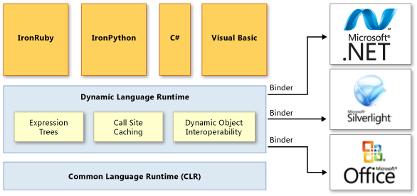

# Lenguajes de programación. Seminario 2

### Integrantes

- Javier E. Domínguez Hernández C-312
- David Orlando De Quesada Oliva C-311
- Daniel de la Cruz Prieto C-311

## Tema 4: Dynamic en C#

## 4.¿Que se entiende por DLR y CLR en .NET?


## CLR:
  .NET proporciona un run-time environment, denominado Common Language Runtime(CLR), que ejecuta el código y proporciona servicios qie facilitan el proceso de desarrollo. Los compiladores y las herramientas exponen la funcionalidad del Common Langugage Runtime y le permite escribir código que se beneficie de este entorno de ejecución controlado(managed excution environment). El código que desarrolles con un compilador de lenguaje que tiene como objetivo el tiempo de ejecución se llama código administrativo(managed code). El código administrativo se beneficia de características como la integración entre lenguajes (cross-language), el manaje de excepciones entre lenguajes (cross-language exception handling), la seguridad mejorada(enhanced security), el control de versiones y el siporte de implementación, un modelo simplificado para la interacción de componentes y la depuración y perfilado de servicios. Para permitir que el tiempo de ejecución proporcione servicios al código administrado, los compiladores de lenguaje deben emitir metadatos que describan los tipos, miembros y referencias en su código. Los metadatos se almacenan con el código; los archivos ejecutables portables (Portable execute(PE)) cargados del Common Language Runtime contienen metadatos. El runtime usa los metadatos para localizar y cargar clases, diseñar instancias en memoria, resolver invocaciones a métodos, generar código nativo, reforzar la seguridad y establecer límites de contexto en tiempo de ejecución. El runtime maneja automáticamente el diseño y administra las referencias a
  a los objetos, liberándolos cuando ya no se utilizan. Los objetos cuya vida útil se gestiona de esta forma se denominan managed data. El garbage collecto elimina la pérdida de mmeoria, así como algunos otros errores de programación comunes. Si el código está administrado, se puede usar datos administrados, datos no administrados o datos administrados y no administrados en la aplicación .NET. Debido a que los compiladores de lenguaje proporcionan sus propios tipos, como los tipos primitivos, es posible que no siempre sepa(o necesite) si sus datos están siendo administrados. El CLR facilita el diseño de componentes y aplicaciones cuyos objetos interactúan entre lenguajes. Objetos escritos en diferentes lenguajes pueden comunicarse entre sí y sus comportamientos pueden integrarse estrechamente. Por ejemplo, puede definirse una clase y luego usar un lenguaje diferente para derivar una clase de sus clase original o llamar a un método en la clase original. También puede pasar una instancia de una clase a un método de una clase escrito en un lenguaje diferente. Esta integración entre lenguajes  es posible  porque los compiladores de lenguajes y las herramientas que tienen como objetivo el runtime utilizan un sistema de tipo común (Commun Type System) definido por el runtime, y siguen las reglas del runtime para definir nuevos tipos, así como crear, usar, persistir, y vincularse a tipos. Como parte de sus metadatos, todos los componentes administrados contienen información sobre los componentes y recursos con los que se crearon. El runtime usa esta información para asegurarse de que su componente o aplicación tenga las versiones especificadas de todo lo que necesita, lo que hace que sus código sea menos probable que se rompa debido a alguna dependencia no satisfecha. La información del registro y los datos de estado ya no se almacenan en el registro, donde puede ser difícil establecerlos y mantenerlos.  En cambio, la información sobre los tipos que define(y sus dependencias) se almacena con el código como un metadato, lo que permite que las tareas de replicación  y eliminación de componentes sea mucho menos complicadas. Los compiladores de lenguajes y las herramientas exponen la funcionalidad del runtime de formas que están destinadas a ser útiles e intuitivas para  los desarrolladores. Esto significa que algunas característica del runtime pueden ser más notables en un entorno que en otro. La forma en que se experimente el runtime depende de qué compiladores de lenguaje o herramientas se use. Por ejemplo, si eres un desarrollador de Visual Basic, es posible que observes que con el CLR, el lenguaje Visual Basic tiene más características orientadas a objetos que antes.
  
  El siguiente diagrama muestra el modelo de ejecución del CLR:
  
  

  **El runtime proporciona los siguientes beneficios:**

  * Mejoras de rendimiento
  * La capacidad de utilizar fácilmentecomponentes desarrollados en otros lenguajes
  * Tipos extensibles proporcionados por unabiblioteca de clases
  * Características del lenguaje como herencia,interface y sobrecarga para la programaciónorientada a objetos.
  * Soporte para subprocesos libres explícitosque permiten la creación de aplicacionesescalables y multiproceso.
  * Soporte para el manejo estructurado deexcepciones.
  * Soporte para atributos personalizados
  * Garbage collection
  * Uso de delegates en lugar de punteros defunciones para una mayor seguridad yprotección de tipos. 

## DLR:

Dynamic Language Runtime(DLR) es un entorno del runtime que agrega un conjunto de servicios para lenguajes dinámicos al Common Language Runtime(CLR). El DLR facilita el desarrollo de lenguajes dinámicos para que se ejecuten en .NET y adiciona funciones dinámicas a los lenguajes de tipado estático. El propósito del DLR es permitir que un sistema de lenguajes lenguajes dinámicos se ejecuten en .NET Framework y brindarles interoperabilidad .NET. El DLR agrega objetos dinámicos a C# y Visual Basic para suportar el comportamiento dinámico en estos lenguajes y permitir su interoperabilidad con lenguajes dinámicos. DLR también ayuda a crear bibliotecas que admitan operaciones dinámicas. Por ejemplo, si tiene una biblioteca que utiliza objetos XML o JSON, sus objeos pueden aparecer como objetos dinámicos en lenguajes que hacen uso del DLR. Esto permite a las librerias de usuario escritir código sintácticamente más simple y natural para acceder a miembros de los objetos. Por ejemplo, puede usar el siguiente código para incrementar in contador en XML en C#:
```
Scriptobj.SetProperty("Count", ((int)GetProperty("Count")) + 1);
```
Al usar DLR, se puede usar el siguiente código en su lugar:
```
scriptobj.Count += 1;
```

## Arquitectura DLR:


 
El DLR agrega un conjunto de servicios al CLR papra un mejor soporte de lenguajes dinámicos. Estos servicios incluyen lo siguiente:

  * Expression trees. El DLR usa arbóles de expresión para representar la semántica del lenguaje. Para este propósito, el DLR ha extendido los árboles de expresión LINQ para incluir el flujo de control, la asignación otros nodos del modelado del lenguaje.
  * Cache site changing. Un sitio de llamado dinámico(dynamic call site) es un lugar en el código donde se realiza una operación como _a+b_ o _a.b()_ en objetos dinámicos. El DLR almacena en caché las características de a y b(generalmento los tipos de estos objetos) y la información sobre la operación. Si tal operación se ha realizado previamente, el DLR recupera toda la información necesaria de la caché para un envío rápido.
  * Dynamic object interoperability. El DLR proporciona un conjunto de clases e interfaces que representan operaciones y objetos dinámicos que pueden ser usados por language implementers y autores de bibliotecas dinámicas. Estas clases e interfaces incluyen **IDynamicMetaObjectProvider**, **DynamicMetaObject**, **DynamicObject**, y **ExpandoObject**.


DLR (Dynamic Language Runtime) es una libreriaque todos lenguajes dinamicos y el compiladorde C# usan para ejecutar codigo dinamico.
El proposito del DLR es permitir que un sistemade lenguajes dinamicos se ejecute en .NetFramework y brindarles interoperatividad .Net.El DLR annade objetos dinamicos a C# y VisualBasic para admitir el comportamiento dinamicoen estos lenguajes y permitir su interoperacioncon lenguajes dinamicos.
El DLR es un entorno de ejecucion que agrega unconjunto de servicios para lenguajes dinamicosal CLR (Common Language Runtime). El DLRfacilita el desarrollo de lenguajes dinamicospara que se ejecuten en .Net Framework y laadicion de funciones dinamicas a los lenguajesestaticos.

  #### Ventajas principales de los DLR

  1. Simplifica la portabilidad de lenguajes dinamicos a .Net Framework
  2. Habilita funciones dinamicas en lenguajes tipados estáticamente.
  3. Proporciona beneficios futuros de DLR y .Net Framework.
  4. Permite compartir bibliotecas y objetos.


## 5.¿Están al mismo nivel en la arquitectura de .Net ?

DLR es solo otra biblioteca. No esta al mismo nivel que  CLR, no se ocupa de la compilacion JIT, la clasificacion de API nativas, la recoleccion de basura, etc. Pero se basa en gran parte del trabajo en .Net 2.0 y 3.5, en particular los tipos *DynamicMethod* y *Expression*. La API del arbol de expresiones se ha ampliado en .Net4 para permitir que el DLR tambien exprese más conceptos. La siguiente figura muestra un diagrama.


DLR se basa en CLR y ofrece servicios para lenguajes dinámicos: tipos dinamicos, distribución de metodos dinámicos, generación de codigo, etc. La idea es hacer que esas sean uniformes y compartirlas entre lenguajes dinámicos para que funcionen de manera predecible y similar, la igual que como sucede con CLR con otros lenguajes.
De cierta manera son comparables estos conceptos, un lenguaje en .Net usa CLR, un lenguaje dinámico deberia usar DLR, pero tambien usara CLR. Son conjuntos básicos de funcionalidades que los diseñadores consideraron buenas cuando son comunes en todos los lenguajes. IronPython y IronRuby se implementaron sobre DLR, al igual que la funcion **dynamic** de C# 4.

## 6. ¿Qué representan call site , receiver y binder ?


 
## Call site:
Es una especie de átomo del DLR, el más pequeño
fragmento de código que se puede considerar como una unidad ejecutable.Una expresión puede
contiener muchos call sites, pero el comportamiento se construye de forma natural, evaluando un **call
site** a la vez. 

Ejemplo, donde d es  una variable de tipo dinámico:
```
d.Foo (10);
```

El call site se representa en código como **System.Runtime.CompilerServices.Call-Site<T>**.

Ejemplo del código que podría ser llamado para crear el site para el fragmento anterior:

```
CallSite<Action<CallSite, object, int>>.Create(Binder.InvokeMember(
CSharpBinderFlags.ResultDiscarded, "Foo", null, typeof(Test),
new CSharpArgumentInfo[] {
CSharpArgumentInfo.Create(CSharpArgumentInfoFlags.None, null),
CSharpArgumentInfo.Create(CSharpArgumentInfoFlags.Constant |
CSharpArgumentInfoFlags.UseCompileTimeType,
null) }));
```

## Receivers y Binders:
Además de un call site, es necesario algo para decidir qué significa y cómo se ejecuta. En el DLR, dos entidades pueden decidir esto: el **receiver** y el **binder**. El receiver de un call es simplemente el objeto se llama a un miembro. En el call site del ejemplo, el receiver es el objeto al que se refiere d en tiempo de ejecución. El binder depende del lenguaje de la llamada (calling language), y forma parte del call site; en este caso se puede observar que el comppilador d C# emite código para crear un binding usando **Binder.InvokeMember**. La clase Binder en este caso es **Microsoft.CSharp.RuntimeBinder.Binder**, por lo que realmente is específico de C#. El binder de C# también es COM-aware, y realizará un COM-binding apropiado si el receiver es un objeto **IDispatch**. El DLR siempre da prioridad al receiver: si es un objeto dinámico que conoce como manejar el call, luego usuará cualquier execution path que proporcione el objeto. Si el receiver no es dinámico , el binder decide cómo se debe ser ejecutado el código. En el código de ejemplo, aplicaría reglas específicas de C# al código y resolvería que hacer


